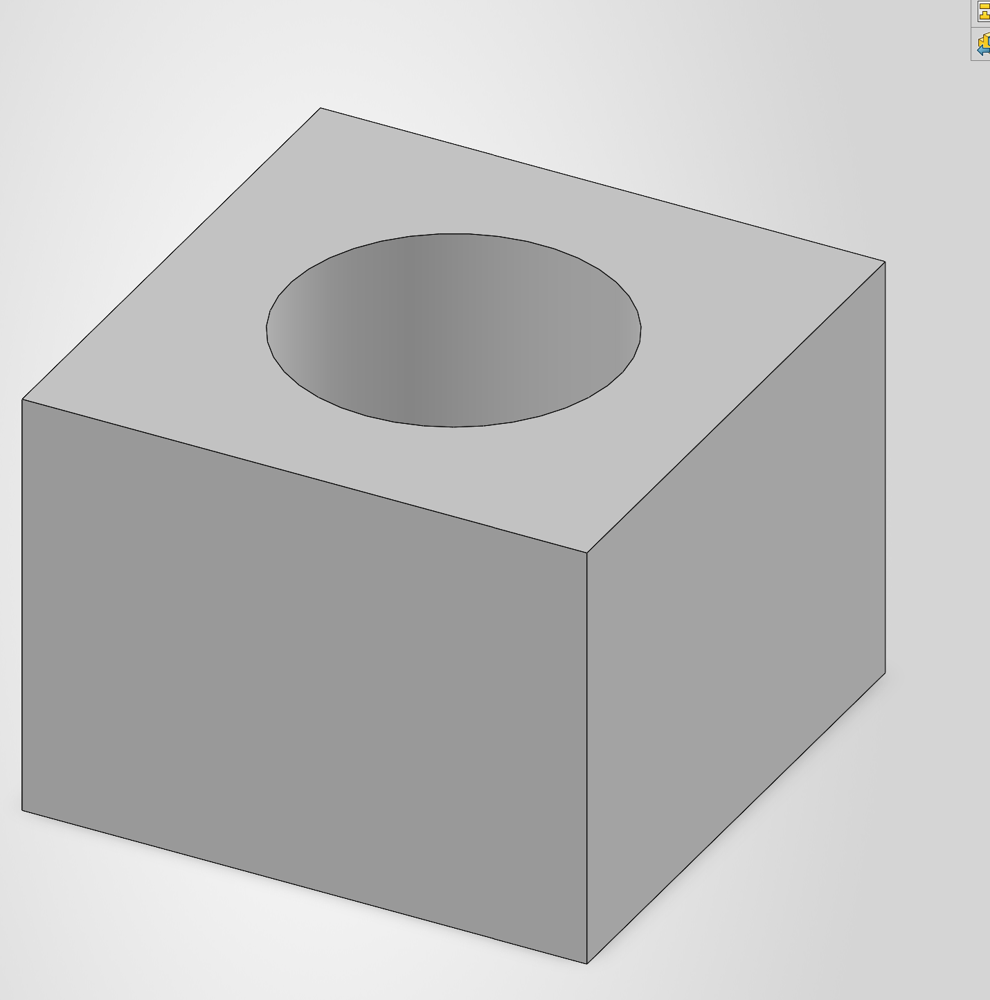
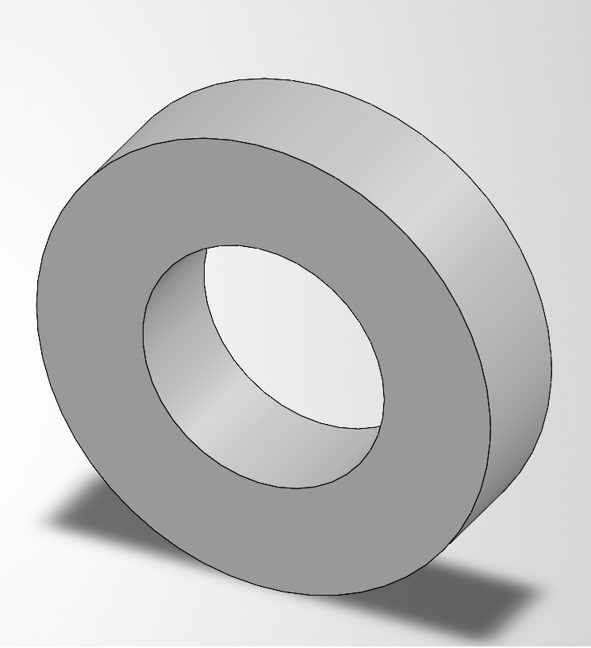
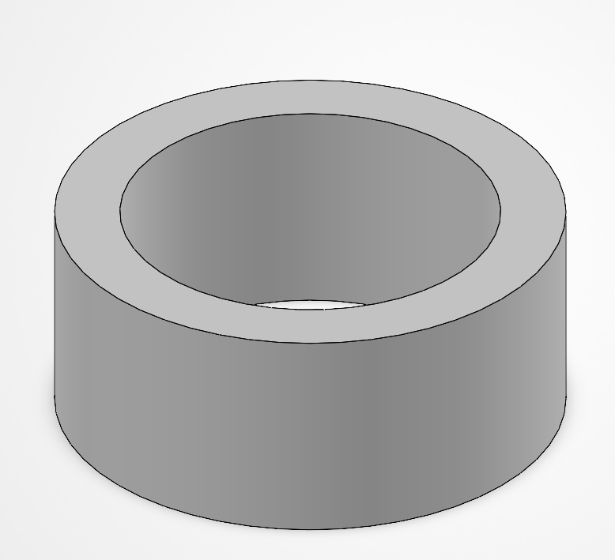
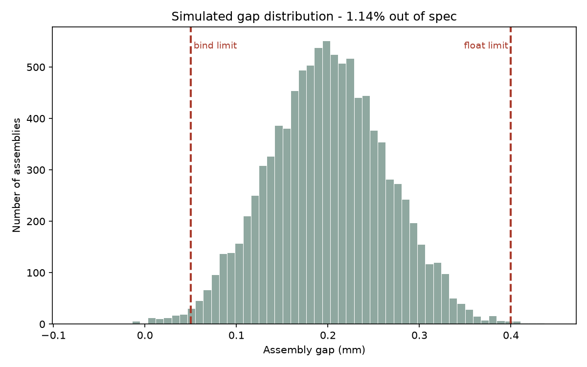
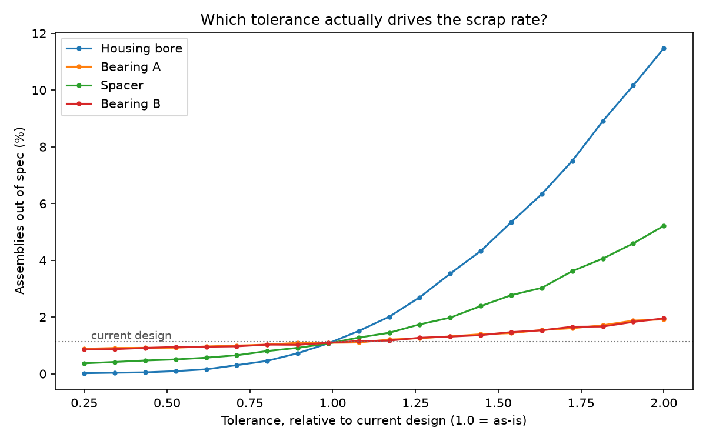

# Tolerance Stack-Up Analysis: Bearing Housing Assembly

A Monte Carlo tolerance analysis tool that predicts assembly scrap rate and
identifies which single dimension drives it.

**Headline result:** halving the tolerance on the housing bore alone drops the
predicted out-of-spec rate from **1.13% to 0.10%**. Halving either bearing
tolerance barely moves it. The bore is the dimension worth paying to control.

---

## The problem

Parts never come out at exactly the size on the drawing. When several stack
together, those small variations add up, and sometimes the assembly doesn't
work. The question a manufacturing engineer has to answer is not *"could this
fail?"* but *"how often will it fail, and which tolerance should I tighten?"*

Worst-case stack-up answers the first question badly and the second not at all.

## The assembly

A housing bore holds a bearing, a spacer, and a second bearing. An end cap
closes it. The leftover **gap** must land inside a spec range:

- Gap too small -> the cap preloads the bearings and they bind
- Gap too large -> the shaft floats axially

| Dimension | Nominal | Tolerance | Rationale |
|---|---|---|---|
| Housing bore depth | 44.20 mm | ± 0.15 | Machined feature, hardest to hold |
| Bearing A width | 12.00 mm | ± 0.05 | Purchased (6005), supplier-controlled |
| Spacer width | 20.00 mm | ± 0.10 | Turned in-house |
| Bearing B width | 12.00 mm | ± 0.05 | Purchased (6005), supplier-controlled |

Nominal gap = 44.20 − 44.00 = **0.20 mm**
Spec range = **0.05 to 0.40 mm**

Parts modeled in SOLIDWORKS:

| Housing | Bearing (6005) | Spacer |
|---|---|---|
|  |  |  |

## Method

Three approaches, compared:

**Worst case** — every dimension at its extreme simultaneously. Sum the
tolerances arithmetically.

**RSS (root-sum-square)** — square each tolerance, sum, take the square root.
Assumes variations are independent and normally distributed.

**Monte Carlo** — simulate 10,000 assemblies. Each part gets a random size drawn
from a normal distribution, then check whether the resulting gap falls inside
spec. Count the failures.

Part sizes are drawn using `random.gauss(nominal, tolerance/3)`. Dividing by 3
treats the tolerance band as ± 3 standard deviations, so roughly 99.7% of parts
fall inside it — the standard assumption for a centered, capable process.

## Results

| Method | Predicted gap range | Verdict |
|---|---|---|
| Worst case | −0.150 to +0.550 mm | Fails badly on both ends |
| RSS | +0.006 to +0.394 mm | Marginal on the tight end |
| Monte Carlo | 1.09% out of spec | ~1 in 92 assemblies |

Worst case says the parts might not physically fit. Monte Carlo says that
essentially never happens, and the real scrap rate is near 1%. Those are very
different business decisions — one triggers a redesign, the other means planning
for a small amount of rework.

Failures are also asymmetric: **95 assemblies came out too tight versus 14 too
loose**. The design sits closer to the bind limit than the float limit, so if
anything it should be shifted toward a slightly larger nominal gap.



### Which tolerance matters

Each tolerance was swept independently while the others were held at their
baseline values (200,000 trials per point for smoother curves, which gives a
baseline of 1.13% versus 1.09% at 10,000 — the difference is simulation noise):

| Halve this tolerance | Scrap rate |
|---|---|
| **Housing bore** (0.150 -> 0.075) | 1.13% -> **0.10%** |
| Spacer (0.100 -> 0.050) | 1.13% -> 0.52% |
| Bearing A (0.050 -> 0.025) | 1.13% -> 0.92% |
| Bearing B (0.050 -> 0.025) | 1.13% -> 0.91% |



**Recommendation:** tighten the housing bore. The purchased bearings are not
worth renegotiating with the supplier — their contribution is small, and
tightening them costs money for almost no benefit.

## A chart that lied

The first version of the sweep plot put absolute tolerance (mm) on the x-axis.
Because the bore's baseline tolerance (± 0.15) is three times the bearings'
(± 0.05), the lines started from very different places and the bore appeared to
be the *least* important contributor — the exact opposite of the truth.

Re-plotting against tolerance *relative to the current design* forces every
curve through a common point at 1.0, making the slopes directly comparable. The
bore is then obviously dominant.

Worth recording because the numbers never changed — only the axis did.

## Limitations

- **Normal distribution assumed.** Real machining processes drift as tools wear,
  which produces skewed or off-center distributions. A shifted mean would change
  these numbers significantly.
- **Process assumed centered and capable.** The tolerance/3 relationship implies
  Cpk = 1.0. A real shop may run better or worse.
- **Dimensions assumed independent.** Parts from the same machine on the same day
  are often correlated, which the model does not capture.
- **Simulation noise.** At 10,000 trials the failure rate varies by roughly
  ± 0.1% run to run.
- **Modeling note.** The spacer bore carries a residual draft angle from the
  extruded cut. It does not affect the stack chain, which depends only on part
  widths.

## Files

| File | Purpose |
|---|---|
| `stackup.py` | Worst case, RSS, Monte Carlo, and the gap distribution histogram |
| `sweep.py` | Sensitivity sweep of each tolerance |
| `gap_distribution.png` | Simulated gap distribution against spec limits |
| `tolerance_sweep.png` | Scrap rate vs. relative tolerance, all four dimensions |
| `housing.png`, `bearing.png`, `spacer.png` | SOLIDWORKS part models |

## Running it

```
pip install numpy matplotlib
python stackup.py
python sweep.py
```

---

*Built by Faisal Kola. Mechanical Engineering Technology.*
